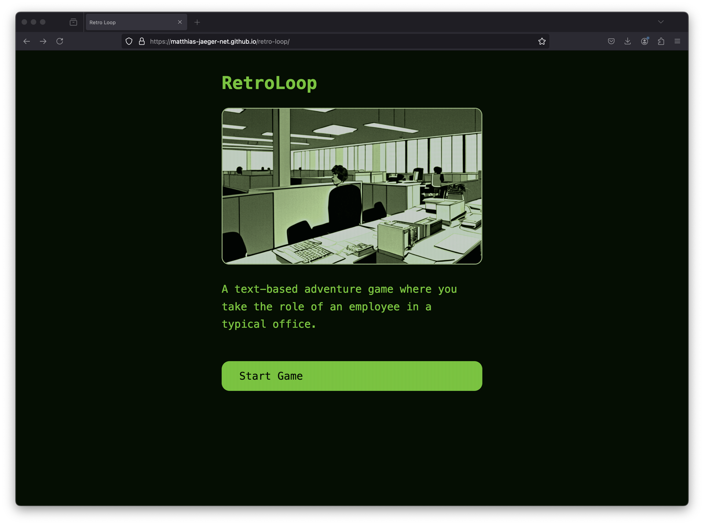

# RetroLoop

> A text-based adventure gane where you play as an employee of a global corporation. Story and game development by ChatGpt <chat.openai.com> and Matthias Jäger. Images by DiffusionBee <diffusionbee.com>



# https://matthias-jaeger-net.github.io/retro-loop/

## Todos game design:

-   [x] Basic story from start to finish
-   [ ] More sophisticted story
-   [ ] Develop a character players can relate to
-   [x] Basic set of ambient sounds in place
-   [ ] Different sounds based on scene
-   [x] Generative images, drawings or other graphical assets
-   [ ] Meaningful scene images

## Todos technnical:

-   [x] Implement a global state for the player
-   [x] Update the player state from the scene
-   [ ] Establish conditional branching in scene, based on player object state
-   [ ] Implement an inventory that has an effect on the choices
-   [ ] How to write a test for story.js?

# Contributor hints

```javaScript
/**
* Story (Example)
* - Make sure you test additions to story
*/
const story = {
    ...
    sceneName: {
        // Mandatory:
        // Give the scene a meaningful title
        title: "The headline of the scene",
        // Mandatory:
        // Describe the scenes vibe and choices without too
        // much words and lengthy text that no one reads
        description:
            "A short body of text to describe the current scene",
        // Optional:
        // One or more choices are rendered as buttons with a
        // callback to the scene to be played
        choices: [
            // <button onclick="renderScene(next)">label</button>
            { label: "Button text", next: "Name of the scene" },
            { label: "Button text", next: "Name of the scene" },
            ...
        ],
        // Optional:
        // Render an image from the images folder
        thumbnail: "images/cover.png",
        // Optional:
        // Add elements to the inventory in the global
        // playerState object
        // TODO: implement branching based on inventory
        inventory: [
            "test"
        ],
        // Optional:
        // Player can take damage when visiting a scene
        // renderScene checks and calls gameOver when the
        // playerState.health goes below 0
        damage: 20,

    },
    ...
}
```
